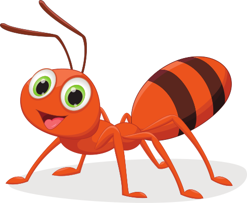

[](https://github.com/polystat/awesome-bugs/actions/workflows/main.yml)
[](https://github.com/polystat/awesome-bugs/blob/master/LICENSE.txt)
[](https://hitsofcode.com/view/github/polystat/awesome-bugs)


**DISCLAIMER**: The work is still in progress!

This is a taxonomy of software defects and a benchmarking scripts which validates
which of the mentioned defects can be detected by which static analyzers.

While building the taxonomy we took into account the following classifications:

  * [MISRA C/C++](..)
  * ...

We are not trying to make an exhaustive list of defects, but mostly focus
on defects related to object-oriented structure of code. We classify by 
OO features being used in a defective program:

```
defects/
  classes/
  objects/
  inheritance/
  assertions/
  concurrency/
  null/
  operators/
    division/
      div-by-zero-when-reading-file.yml
      div-by-zero-in-simple-method.yml
    increment/
  loops/
  polymorphism/
  arrays/
  numbers/
  contracts/
  annotations/
  monads/
  traits/
  overloading/
  encapsulation/
  reflection/
  strings/
  pointers/
```

Each defect is presented in YAML format, similar to this one
(in a file `div-by-zero-in-simple-method.yml`):

```
title: A division without checking for zero may lead to division by zero
description: An error can occur when divided by the value received as an argument to the method
features: 
  - operators/division
  - loops
language: java
bad:
  foo.java: |
    class Foo {
      int f(int x) {
        return 42 / x;
      }
    }
  foo.eo: |
    [] > Foo
      [] > new
        [x] > f
          42.div x > @
good:
  foo.java: |
    class Foo {
      int f(int x) {
        if(x!=0) {
          return 42 / x;
        }
       }
    }
  foo.eo: |
    [] > Foo
      [] > new
        [x] > f
          if. > @
            x.neq 0
            42.div x
            TRUE
```

Temporarily (until we have powerful enough Java/C++/Python to EO translators) we
keep EO code snippets in the YAML files too. They are excluded from the testing
process when, for example, Java code is being tested with Java-specific static
analyzers. They only are used when Polystat is being tested.

Both `bad` and `good` sections are mandatory. Intuitively, the `bad` section
contains a program with a bug, while the `good` one has a similar program
but without a bug.

### Analizers 
The following static analyzers are participating in the comparison::

   * [Polystat](https://github.com/polystat/polystat)
   * [Clang-Tidy](https://clang.llvm.org/extra/clang-tidy/)
   * [CppCheck](https://cppcheck.sourceforge.io/)
   * [SVF](https://github.com/SVF-tools/SVF)
